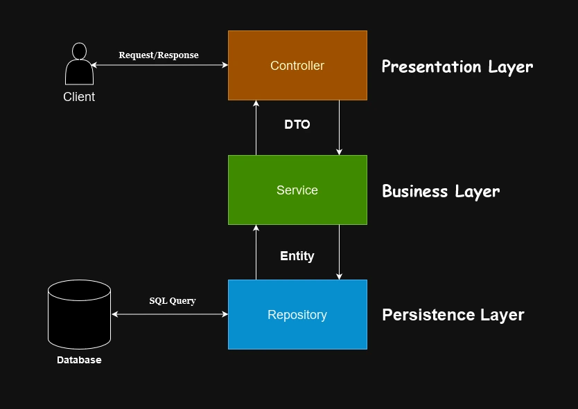

<h1 style="color: #42b883">Java Spring: Layered Architecture and Dependency Injection</h1>

<h2 style="color: #42b883">Layered Architecture</h2>
In Java Spring, layered architecture refers to the separation of the application into layers that have different responsibilities and work independently of each other.
Layered architecture is a modern and effective approach for the concept of **maintainability**, which is one of the basic principles of software development.
It is a necessary method for the maintenance of large projects and for the easy adaptation of new developers joining the project.



This architecture usually consists of 3 main layers:

<h3 style="color: #42b883;">Presentation Layer</h3>


Interaction with the client is provided at this layer. Based on the User example;
The get request made in a Vue.js component is first handled in this layer, after the necessary operations are performed,
it is forwarded to the next layer. The result is sent back to the client as a response.


Client sends a request
```vue
<script >
  // Get user with id 1
  const { data: user } = useFetch('/api/users/1')
</script>
```

 Request reaches the UserController class in the Presentation Layer for processing.
###### // UserController.java
```java
@RestController
@RequestMapping("/api")
public class UserController {

    private final UserService userService;

    @GetMapping("/users/{userId}")
    public User getUserById(@PathVariable("userId") Long userId) {
        return userService.getUser(userId);
    }
}
```

After this stage, the User Controller connects to the User Service and returns the information from the User Service as a response to the client after a series of operations.

<h3 style="color: #42b883;">Business Layer</h3>


<h3 style="color: #42b883;">Persistence Layer</h3>

